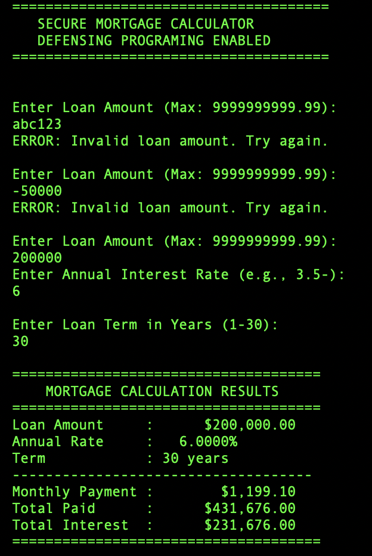
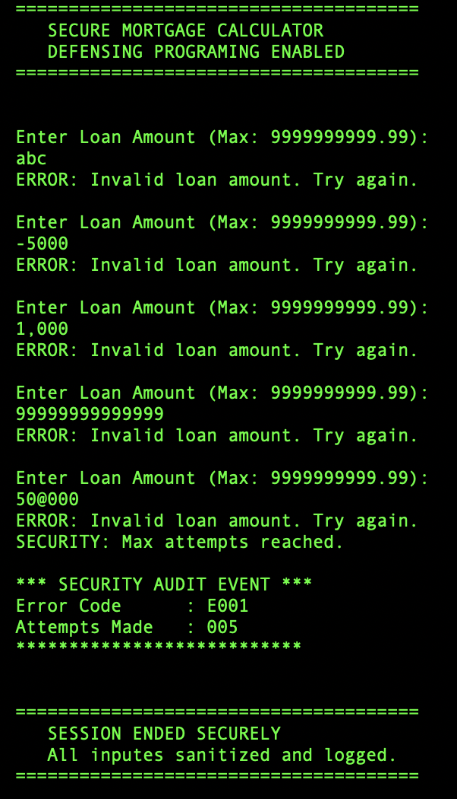

# Legacy Systems Security Lab — Secure Mortgage Calculator

A COBOL financial module that demonstrates how **input-validation vulnerabilities** occur in legacy banking systems, and how **defensive programming** mitigates them.

The program is a working mortgage calculator on the surface. Its real purpose is to show how a hardened legacy system safely handles untrusted user input — rejecting, sanitizing, and logging bad data instead of trusting it.

> **Author:** Angeline Nicole Faina
> **Language:** COBOL (compiled with GnuCOBOL)
> **Type:** Personal security portfolio project

---

## Why this project exists

Legacy banking systems are frequently written in COBOL and predate modern security practices. Many were built assuming input was always well-formed, so they fed raw user data directly into calculations or queries. That assumption is the root of an entire class of vulnerabilities.

This project recreates a realistic financial routine and then defends it against the input-handling failures that legacy systems are prone to:

- **Injection** — malicious characters or commands embedded in input
- **Buffer overflow** — input longer than the field is sized to hold
- **Invalid / malformed data** — empty, non-numeric, or negative values
- **Numeric overflow** — values too large for the calculation to handle
- **Precision errors** — incorrect rounding or truncation in financial math

The guiding principle throughout: **never trust input. Prove it is safe before converting it to a number.**

---

## What it does

The program calculates a fixed monthly mortgage payment from three inputs:

- Loan amount (principal)
- Annual interest rate
- Loan term in years

It then reports the monthly payment, total amount paid over the life of the loan, and total interest.

The financial formula used is the standard amortized mortgage payment:

```
M = P × [ r(1 + r)^n ] / [ (1 + r)^n − 1 ]
```

| Symbol | Meaning |
|--------|---------|
| `M` | Monthly payment |
| `P` | Principal (loan amount) |
| `r` | Monthly interest rate (annual ÷ 12 ÷ 100) |
| `n` | Total number of payments (years × 12) |

Because COBOL has no built-in exponentiation, `(1 + r)^n` is computed manually with a loop.

---

## The security layer (the real focus)

Every input passes through layered defensive checks **before** it is converted to a number or used in any calculation:

| Defense | What it does | Vulnerability it addresses |
|---------|-------------|----------------------------|
| Empty-input check | Rejects blank submissions | Malformed data |
| Negative-sign check | Rejects values beginning with `-` | Invalid financial data |
| Length check | Rejects input longer than the field allows | Buffer overflow |
| Character-by-character scan | Confirms only digits (and a decimal point) are present | Injection |
| Boundary check | Confirms values fall within sane ranges | Numeric overflow / absurd values |
| Attempt limiting + audit log | Halts after 5 failed attempts and records a coded security event | Brute-force / abuse detection |

Valid input ranges enforced:

- **Loan amount:** greater than 0, up to 9,999,999,999.99
- **Interest rate:** greater than 0, up to 30%
- **Loan term:** 1 to 30 years

Fixed-precision numeric fields (`PIC` clauses with defined decimal places) are used throughout to keep financial calculations accurate and avoid floating-point rounding drift.

When validation fails repeatedly, the program logs a security audit event with an error code (`E001`–`E003`), the number of attempts made, and exits safely rather than continuing in an unknown state.

---

## How to build and run

Requires [GnuCOBOL](https://gnucobol.sourceforge.io/).

```bash
# Compile (fixed-format source)
cobc -x -o mortgage MortgageCalculator.cob

# Run
./mortgage
```

---

## Example: defensive behavior

The program rejects unsafe input and re-prompts rather than processing it:

```
Enter Loan Amount (Max: 9999999999.99):
abc123
ERROR: Invalid loan amount. Try again.

Enter Loan Amount (Max: 9999999999.99):
-50000
ERROR: Invalid loan amount. Try again.

Enter Loan Amount (Max: 9999999999.99):
200000
Enter Annual Interest Rate (e.g., 3.5):
6
Enter Loan Term in Years (1-30):
30

=====================================
    MORTGAGE CALCULATION RESULTS
=====================================
Loan Amount     :      $200,000.00
Annual Rate     :   6.0000%
Term            : 30 years
------------------------------------
Monthly Payment :        $1,199.10
Total Paid      :      $431,676.00
Total Interest  :      $231,676.00
=====================================
```





---

## Test cases

| Input | Field | Expected result |
|-------|-------|-----------------|
| _(empty)_ | any | Rejected |
| `-50000` | amount | Rejected (negative) |
| `abc123` | amount | Rejected (non-numeric) |
| `99999999999999` | amount | Rejected (too long / overflow) |
| `'; DROP TABLE` | any | Rejected (invalid characters) |
| `35` | rate | Rejected (exceeds 30% cap) |
| `50` | years | Rejected (exceeds 30-year cap) |
| `200000` / `6` / `30` | all | Accepted → calculates correctly |

---

## Project status

- [x] Core calculator implemented
- [x] Input validation and sanitization
- [x] Security audit logging
- [ ] Insecure "before" version for side-by-side comparison
- [ ] AWS deployment

## License

Personal educational project. Free to reference for learning purposes.
